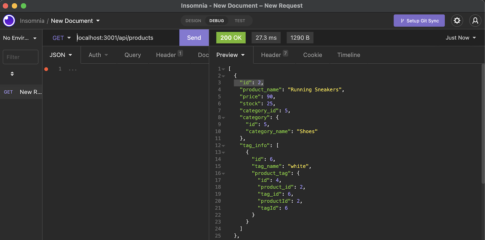
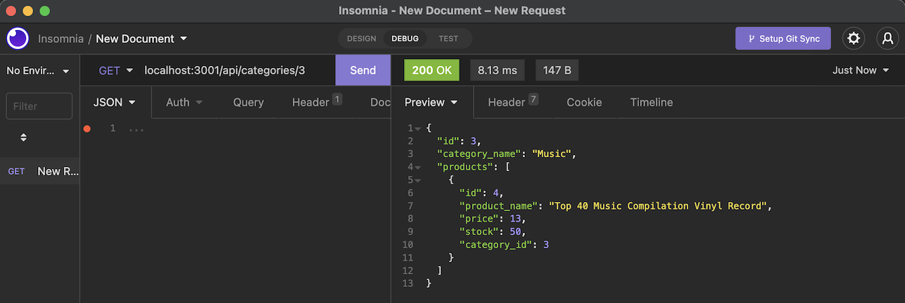
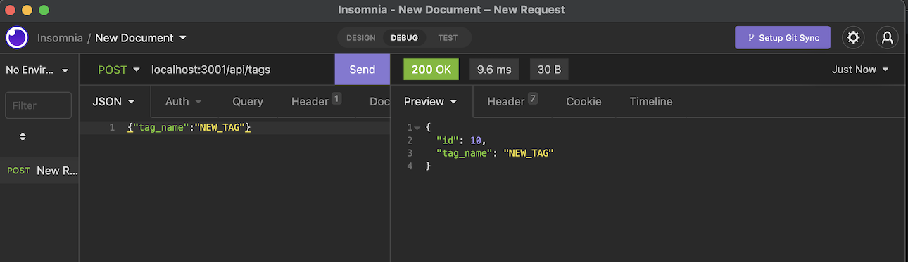

# eCommerce Back-End

   [](https://opensource.org/licenses/MIT)

  ## Description
  This project is the result of modified starter code that utilizes Sequelize, node, express, and mysql to provide an interconnected database and API routes to track products, categories, and tags.

  * * * * * *


  ## Table of Contents
  1. [Description](#Description)
  2. [Installation](#Installation)
  3. [Usage](#Usage)
  6. [Questions](#questions)
  7. [License](#License)

  * * * * * *

  <a name="Installation"></a>
  ## Installation
  1. Clone repo
  2. Modify .env
  3. run "npm i"
  4. enter mysql shell and run "SOURCE db/schema.sql;"
  5. run "npm run seed"
  6. then finally run the app with "npm start"

  <a name="Usage"></a>
  ## Usage

  # [LIVE DEMO](https://drive.google.com/file/d/15viaqkK1aYtLevycyK0oHOa-g_Oq-yj1/view)

  After running via "npm start", you can utilize Insomnia (or even the web browser) to call on localhost:3001/api with the GET, POST, PUT, and DELETE routes of /products, /categores, /tags, and their /[id] as a a number

  * * * * * *

  

 * * * * *

 

 * * * * *

 

 * * * * *
 

  <a name="questions"></a>
  ## Questions
  For any questions, contact me at dev@chicken1991.anonaddy.com and [visit my github profile](https://github.com/chicken1991).

  <a name="License"></a>
  ## License


```md
COPYRIGHT 2022 Ben Pitroff
Permission is hereby granted, free of charge, to any person obtaining a copy of this software and associated documentation files (the "Software"), to deal in the Software without restriction, including without limitation the rights to use, copy, modify, merge, publish, distribute, sublicense, and/or sell copies of the Software, and to permit persons to whom the Software is furnished to do so, subject to the following conditions:

The above copyright notice and this permission notice shall be included in all copies or substantial portions of the Software.

THE SOFTWARE IS PROVIDED "AS IS", WITHOUT WARRANTY OF ANY KIND, EXPRESS OR IMPLIED, INCLUDING BUT NOT LIMITED TO THE WARRANTIES OF MERCHANTABILITY, FITNESS FOR A PARTICULAR PURPOSE AND NONINFRINGEMENT. IN NO EVENT SHALL THE AUTHORS OR COPYRIGHT HOLDERS BE LIABLE FOR ANY CLAIM, DAMAGES OR OTHER LIABILITY, WHETHER IN AN ACTION OF CONTRACT, TORT OR OTHERWISE, ARISING FROM, OUT OF OR IN CONNECTION WITH THE SOFTWARE OR THE USE OR OTHER DEALINGS IN THE SOFTWARE.
```        


[License: MIT](https://opensource.org/licenses/MIT)
